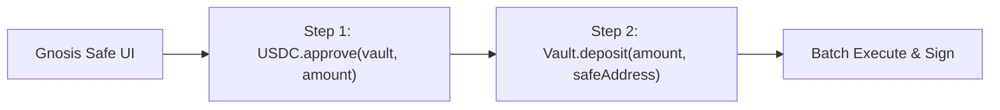

# No-Code Automation & Workflows

:::note[Advanced Topic]
**Target Audience**: This guide is intended for **DAO Treasury Managers, Operators, and Power Users** who need to interact directly with on-chain contracts using Gnosis Safe multisig batches, raw block explorer calls, or automated webhook pipelines without relying on the front-end dApp.
:::

This guide provides step-by-step instructions for non-technical users, DAO treasury managers, and operators to interact with AI Hedge yield vaults using visual, no-code interfaces.

---

## 1. Gnosis Safe Transaction Builder (DAO Treasuries)

If your treasury is managed by a **Gnosis Safe Multisig**, you can batch approvals and deposits directly through Safe's visual interface without writing any scripts.



### Step-by-Step Instructions

1. Open your Safe at [app.safe.global](https://app.safe.global).
2. Go to **Apps** $\rightarrow$ **Transaction Builder**.
3. **Transaction 1 (Approve USDC)**:
   - **Enter Address**: `0x833589fCD6eDb6E08f4c7C32D4f71b54bdA02913` (Base Native USDC)
   - **Method**: Select `approve(address spender, uint256 value)`
   - **`spender`**: Enter the AI Hedge Vault Address (`0x100f0ac3be2c93c76b2ee1b8ca98d8928cdc0871`)
   - **`value`**: Enter the deposit amount with 6 decimals (e.g., `10000000000` for 10,000 USDC)
   - Click **Add Transaction**.
4. **Transaction 2 (Deposit into Vault)**:
   - **Enter Address**: `0x100f0ac3be2c93c76b2ee1b8ca98d8928cdc0871` (AI Hedge USDC Vault)
   - **Method**: Select `deposit(uint256 assets, address receiver)`
   - **`assets`**: Enter the exact same amount (`10000000000`)
   - **`receiver`**: Enter your Gnosis Safe address
   - Click **Add Transaction**.
5. Click **Create Batch** $\rightarrow$ **Submit Batch** and collect required multisig signers.

---

## 2. Block Explorer Direct Interaction (Basescan / Etherscan)

If the web dApp is ever undergoing maintenance, you can always deposit or redeem directly on-chain via the block explorer:

### How to Deposit via Basescan
1. Navigate to the vault contract on [Basescan (0x100f0ac3be2c93c76b2ee1b8ca98d8928cdc0871)](https://basescan.org/address/0x100f0ac3be2c93c76b2ee1b8ca98d8928cdc0871#writeContract).
2. **First, approve the vault** on the [Base USDC Contract](https://basescan.org/address/0x833589fCD6eDb6E08f4c7C32D4f71b54bdA02913#writeContract) using `approve()`.
3. Go to the vault's **Contract** $\rightarrow$ **Write as Proxy / Write Contract** tab.
4. Click **Connect to Web3** (MetaMask, Rabby, or Coinbase Wallet).
5. Find the **`deposit`** function:
   - `assets (uint256)`: Amount in 6 decimals (e.g. `100000000` for 100 USDC).
   - `receiver (address)`: Your wallet address.
6. Click **Write** and confirm the transaction in your wallet.

---

## 3. Automated Yield & APY Alerts (No-Code via n8n or Webhooks)

You can set up automated periodic monitoring using visual automation tools like **n8n** or **Zapier** with standard HTTP requests:

```
[Cron Trigger (Every 6h)] 
      │
      ▼
[HTTP Request: JSON-RPC eth_call to convertToAssets(1000000)]
      │
      ▼
[Compare against Previous Value in Google Sheet / DB]
      │
      ▼
[Send Telegram / Discord Notification]
```

### JSON-RPC Query Payload (Free Base RPC)
* **URL**: `https://mainnet.base.org`
* **Method**: `POST`
* **Body**:
```json
{
  "jsonrpc": "2.0",
  "id": 1,
  "method": "eth_call",
  "params": [
    {
      "to": "0x100f0ac3be2c93c76b2ee1b8ca98d8928cdc0871",
      "data": "0x07a2d13a00000000000000000000000000000000000000000000000000000000000f4240"
    },
    "latest"
  ]
}
```
*(Note: `0x07a2d13a` is `convertToAssets(uint256)`, and `0x0f4240` is 1,000,000 in hex = 1 share unit).*

The hex result in the response is your real-time **Price Per Share**.
