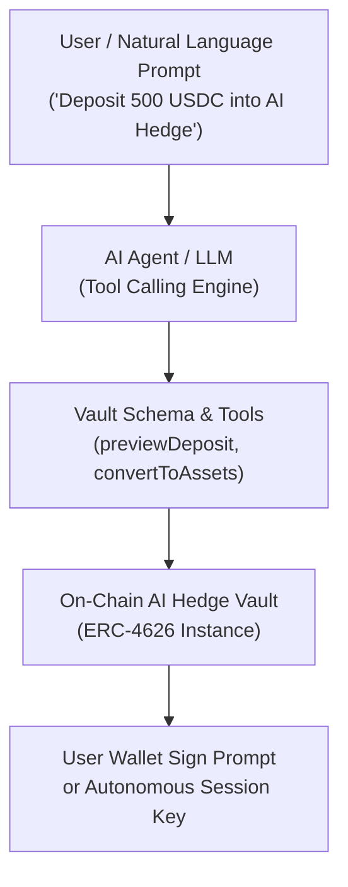

# AI Agent Integration Overview

AI Hedge yield vaults are natively engineered for **AI Agents, Autonomous Assistants, and Non-Technical Allocators**.

Because all AI Hedge vaults implement the standard **ERC-4626 Tokenized Vault interface**, autonomous software agents and LLMs (ChatGPT, Claude, Cursor, Coinbase AgentKit, ElizaOS, LangChain) can read state, calculate yields, simulate outputs, and prepare transactions deterministically.

:::tip[Choose Your Integration Path]
**You only need ONE path based on your role.** The guides in this documentation are standalone options for specific use cases. You do **not** need to complete all of them to deposit or use AI Hedge vaults.
:::

:::danger[Wallet Security & Private Key Disclaimer]
**Safeguard Your Wallet Secrets:** You are solely responsible for the custody, security, and safekeeping of your private keys, seed phrases, API secrets, and automated agent signing keys. Never input raw private keys or seed phrases into public LLM prompts, unencrypted configuration files, or third-party agent tools. 

AI Hedge is non-custodial and has no access to or control over your wallet credentials. AI Hedge and its contributors assume **no responsibility or liability for any loss of funds** resulting from stolen, compromised, leaked, or mishandled private keys, credentials, or automated agent execution keys.

*See the **[Finding Your Wallet Secret & Private Key Guide](./wallet-secrets-guide)** for safe key management practices and wallet-by-wallet instructions.*
:::

---

## 🎯 Which Guide Is Right for You?

Choose the path below that matches what you want to do in this section:

| Your Persona / Role | Your Goal | Recommended Guide |
|---|---|---|
| 💬 **Prompter / Non-Coder** | *"I want to ask ChatGPT or Claude to analyze my earnings, check APY, or generate personal wallet scripts."* | ➡️ **[Prompt Playbook (ChatGPT & Claude)](./prompt-playbook)** *(Copy-paste prompt templates)* |
| 🤖 **AI Agent Builder** | *"I am building an autonomous AI agent, bot, or copilot and need JSON schemas for LLM tool calling."* | ➡️ **[Tool Calling & Function Schemas](./agent-tools-schema)** *(OpenAI, Anthropic, AgentKit, ElizaOS)* |
| 🏛️ **DAO Treasury / Power User** *(Advanced)* | *"I manage a Safe multisig or want to execute deposits directly via block explorers / n8n."* | ➡️ **[No-Code Automation & Workflows](./no-code-workflows)** *(Visual multisig & webhook recipes)* |
| 🔑 **Bot & Script Operator** | *"I need to export and manage private keys securely for my automated script or agent wallet."* | ➡️ **[Finding Your Wallet Secret & Private Key](./wallet-secrets-guide)** *(Key export & dedicated sub-wallets)* |

---

## Why AI Hedge is Built for AI Agents

1. **Deterministic Single-Contract Interface**: The AI agent only needs to know the **vault address** and the standard ERC-4626 ABI. There is no need for the agent to calculate complex DEX swap routes or multi-hop paths.
2. **Mathematical Previews**: Before executing any state change, the agent calls `previewDeposit()` or `previewRedeem()` to verify exact outputs and prevent slippage.
3. **Prompt-Injection Resistant**: Because the vault interface is strictly typed (`assets`, `shares`, `receiver`), an LLM cannot accidentally trigger unintended contract logic.
4. **Standardized Valuation**: The agent computes the real-time NAV of any position simply by querying `convertToAssets(shares)`.

---

## Three Modes of Agent Operation

### 1. Copilot / Chat Assistant (Non-Custodial)
The agent assists human users via chat interfaces (Telegram, Discord, Web UI). The agent queries the vault, formats human-readable answers, and prepares transaction calldata for the user to review and sign in their wallet (MetaMask, Rabby, Coinbase Wallet).

### 2. Autonomous Treasury Agent (Session Keys)
Using Account Abstraction (ERC-4337 or Gnosis Safe modules), a user or DAO grants an AI agent a strictly bounded session key (e.g., *"You may only call `deposit` on the AI Hedge USDC vault up to 1,000 USDC per week"*). The agent operates autonomously without human intervention.

### 3. Agent-to-Agent (A2A) Idle Treasury
Autonomous software agents that earn revenue in USDC (trading bots, AI services, prediction market bots) can automatically park their idle cash into AI Hedge vaults to generate yield until needed.
