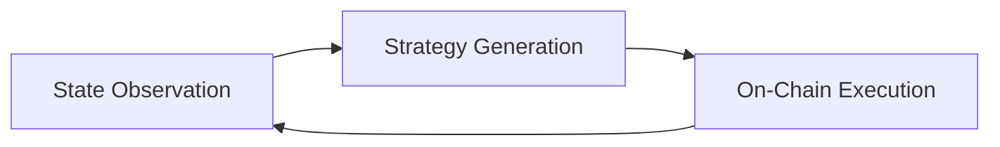

# Protocol Architecture

This section describes the technical architecture and underlying workflow of the AIHedge protocol.

---

## Core Smart Contracts

The AIHedge protocol is implemented as a set of EVM-compatible smart contracts built upon Yearn V3 and ERC-4626:

* **Protocol Registry**: Tracks all active yield vaults, asset registries, curators, and historical performance metrics.
* **Yield Vault Layer (ERC-4626)**: Standardized multi-strategy vault templates managing user deposits, share accounting, limits, and strategy queues.
* **Strategy Adaptors**: Specialized contract interfaces that deposit and withdraw assets directly to/from DeFi providers like Aave, Lido, Curve, and Compound.

---

## Rebalancing Workflow

The automated yield routing works in a three-step cycle:

1. **State Observation**: Off-chain agents query blockchain parameters including liquidity pool APYs, lending demand rates, historical yields, and gas cost structures.
2. **Strategy Generation**: The AI engine processes the observed state to compute the optimal weight allocation across strategies.
3. **On-Chain Execution**: The calculated allocation is submitted to the vault manager or execution contract to adjust strategy deposits, rebalance liquidity, and auto-compound rewards.
