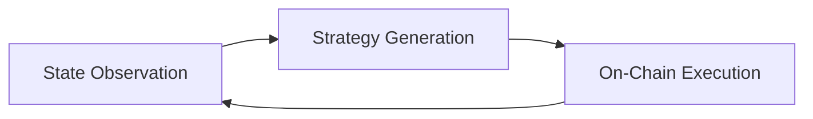

# Protocol Architecture

This section describes the technical architecture and underlying workflow of the AI Hedge protocol.

---

## Core Smart Contracts

The AI Hedge protocol is implemented as a set of EVM-compatible smart contracts built upon the ERC-4626 tokenized vault standard:

* **Protocol Registry**: Tracks all active yield vaults, asset registries, curators, and historical performance metrics.
* **Yield Vault Layer (ERC-4626)**: Standardized multi-strategy vault templates managing user deposits, share accounting, limits, and strategy queues.
* **Strategy Adaptors**: Standardized execution adapters that deploy and withdraw capital directly to and from underlying money markets, liquidity pools, and yield protocols.

---

## Rebalancing Workflow

The automated yield routing works in a continuous three-step cycle:

```mermaid
graph LR
    A[State Observation] --> B[Strategy Generation]
    B --> C[On-Chain Execution]
    C --> A
```

1. **State Observation**: Off-chain agents query blockchain parameters including liquidity pool APYs, lending demand rates, historical yields, and gas cost structures.
2. **Strategy Generation**: The AI engine processes the observed state to compute the optimal weight allocation across strategies.
3. **On-Chain Execution**: The calculated allocation is submitted to the vault manager or execution contract to adjust strategy deposits, rebalance liquidity, and auto-compound rewards.

---

## Fee Architecture

AI Hedge implements a transparent, performance-aligned fee structure:

- **Management Fee (0%)**: 0% recurring AUM fee. 100% of deposited assets remain actively deployed earning returns.
- **Vault Performance Fee (2%)**: A 2% performance fee is deducted strictly from net realized yield upon strategy harvest executions (`report()`). Zero yield generated results in zero fees charged.

:::info[Fee Parameters Note]
Fee parameters described above represent standard baseline configurations and are **subject to change**. Always check the live vault interface for the active fee rate of each individual vault.
:::
