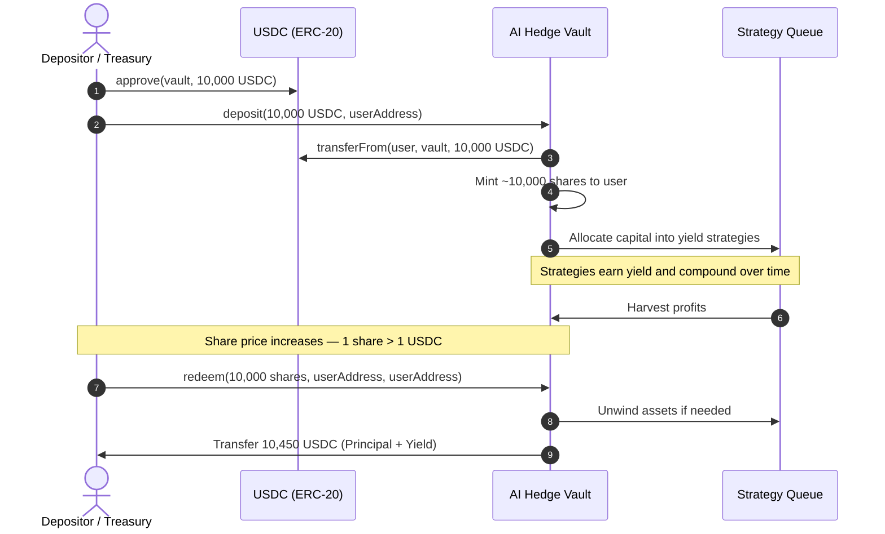

# ERC-4626 Standard & Accounting

> These functions are available on every vault address listed in the **[Contract Addresses](./contract-addresses)** registry.

All AI Hedge yield vaults implement the **ERC-4626 Tokenized Vault Standard** with a modular multi-strategy architecture. This provides a standardized on-chain API for tokenized yield-bearing vaults, ensuring native composability across all DeFi protocols.

---

## 1. On-Chain Interface

Below is the complete interface implemented by all AI Hedge vaults. These are the exact functions callable via any standard Ethereum client (Viem, Ethers.js, Web3.py, Foundry `cast`):

```solidity
// SPDX-License-Identifier: MIT
pragma solidity ^0.8.20;

interface IAIHedgeVault {
    // ── Events ────────────────────────────────────────────────────────
    event Deposit(address indexed sender, address indexed owner, uint256 assets, uint256 shares);
    event Withdraw(address indexed sender, address indexed receiver, address indexed owner, uint256 assets, uint256 shares);

    // ── ERC-20 Base ──────────────────────────────────────────────────
    function name() external view returns (string memory);
    function symbol() external view returns (string memory);
    function decimals() external view returns (uint8);
    function balanceOf(address account) external view returns (uint256);
    function allowance(address owner, address spender) external view returns (uint256);

    // ── Vault Accounting ─────────────────────────────────────────────
    function totalAssets() external view returns (uint256);
    function convertToAssets(uint256 shares) external view returns (uint256);

    // ── Previews (read-only simulations) ─────────────────────────────
    function previewDeposit(uint256 assets) external view returns (uint256 shares);
    function previewRedeem(uint256 shares) external view returns (uint256 assets);
    function previewWithdraw(uint256 assets) external view returns (uint256 shares);

    // ── Deposit Limits ────────────────────────────────────────────────
    function maxDeposit(address receiver) external view returns (uint256 maxAssets);
    function maxRedeem(address owner) external view returns (uint256 maxShares);
    function maxWithdraw(address owner) external view returns (uint256 maxAssets);

    // ── Deposit & Withdraw (state-changing) ───────────────────────────
    function deposit(uint256 assets, address receiver) external returns (uint256 shares);
    function redeem(uint256 shares, address receiver, address owner) external returns (uint256 assets);
    function withdraw(uint256 assets, address receiver, address owner) external returns (uint256 shares);
}
```

:::info[Vault Implementation Details]
To ensure optimal gas efficiency and security, AI Hedge vaults optimize the external interface:
- `mint()` — not used; use `deposit()` to enter vaults
- `convertToShares()` — not supported; use `previewDeposit()` instead
- `pricePerShare()` — compute dynamically via `convertToAssets(10 ** decimals())`
:::

---

## 2. Key Function Specifications

### `deposit(uint256 assets, address receiver)`
Deposits an exact amount of underlying tokens and mints proportionate vault shares to `receiver`.
- **Prerequisite**: Caller must call `IERC20(underlyingToken).approve(vaultAddress, assets)` first.
- **Returns**: `shares` — number of vault share tokens minted.

### `redeem(uint256 shares, address receiver, address owner)`
Burns exact `shares` from `owner` and transfers the corresponding underlying assets to `receiver`.
- **No prior approval needed** when `msg.sender == owner`.
- **Returns**: `assets` — amount of underlying tokens sent to `receiver`.

### `withdraw(uint256 assets, address receiver, address owner)`
Burns the required shares from `owner` to deliver an exact amount of `assets` to `receiver`.
- **Returns**: `shares` — number of shares burned.

---

## 3. Share Pricing & Yield Accrual

AI Hedge multi-strategy vaults operate on a **dynamic share exchange rate**. As underlying strategies harvest yield, `totalAssets()` increases while total share supply remains constant, making each share worth more over time.



### Computing Price Per Share

To compute the real-time **Price Per Share (PPS)** on-chain, pass one full unit of shares ($10^{\text{decimals}}$) into `convertToAssets()`:

```solidity
// PPS = value of 1 full share unit expressed in underlying asset units
uint8 shareDecimals = vault.decimals(); // e.g. 6 for USDC vault
uint256 pricePerShare = vault.convertToAssets(10 ** shareDecimals);

// Example for USDC vault (6 decimals):
// convertToAssets(1_000_000) returning 1_045_321 means 1 share = 1.045321 USDC
```

---

## 4. Previews and Slippage Protection

Always call preview functions before executing to enforce a slippage bound:

```solidity
// 1. Simulate expected output
uint256 expectedShares = vault.previewDeposit(1000 * 1e6); // 1,000 USDC

// 2. Set minimum acceptable output (0.5% max slippage)
uint256 minShares = (expectedShares * 995) / 1000;

// 3. Execute and validate
uint256 actualShares = vault.deposit(1000 * 1e6, msg.sender);
require(actualShares >= minShares, "Slippage exceeded");
```
