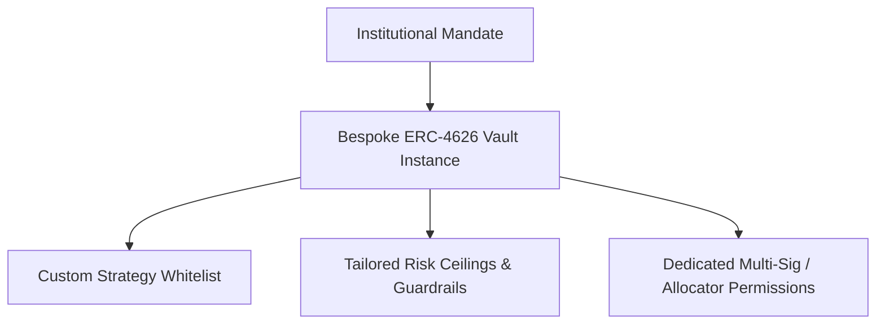

# Institutional Access & Bespoke Curation

AI Hedge provides institutional allocators, DAO treasuries, crypto funds, and family offices with bespoke vault curation, custom risk mandates, and direct **ERC-4626** smart contract composability.

---

## 1. Bespoke Vaults & Custom Curation

For institutional funds managing specialized risk mandates or large capital allocations, AI Hedge supports **dedicated, bespoke ERC-4626 vault instances**:

- **Custom Strategy Whitelists**: Define and approve curated strategy instances permitted within the institutional vault.
- **Tailored Risk Limits**: Define custom circuit-breaker thresholds, TVL caps, slippage boundaries, and maximum allocation weights.
- **Dedicated Allocator Role**: Control asset allocation parameters directly or delegate to AI Hedge's quantitative allocation engine.
- **Non-Custodial Multi-Sig Governance**: Vault parameter changes can be gated by institutional Gnosis Safe multi-signatures.

---

## 2. On-Chain Composability & Custody

All AI Hedge yield vaults implement the standard **ERC-4626 Tokenized Vault interface**, enabling direct on-chain composability with institutional custodians (Fireblocks, Copper, Anchorage) and smart contract treasuries (Gnosis Safe).

- **Direct Non-Custodial Ownership**: Depositors receive ERC-4626 vault shares representing a direct claim on underlying assets and accrued yield.
- **Real-Time NAV Calculation**: The vault's `convertToAssets(shares)` function provides instantaneous on-chain valuation for audit and accounting reconciliation.
- **Instant Unwinding**: Capital can be redeemed at any time without lockup periods or exit fees.

For implementation details, refer to:
- **[ERC-4626 Standard & Accounting](./erc4626-standard.md)**
- **[Solidity Smart Contract Integration](./solidity-integration.md)**
- **[Contract Addresses & Registry](./contract-addresses.md)**

---

## 3. Institutional Onboarding & Contact

For institutional onboarding, OTC settlement coordination, bespoke vault setups, or technical integration support:

- **Institutional Desk Email**: [contact@aihedge.finance](mailto:contact@aihedge.finance)
- **Official DApp**: [dapp.aihedge.finance](https://dapp.aihedge.finance)
- **GitHub**: [github.com/aihedge-finance](https://github.com/aihedge-finance)
- **Documentation**: [docs.aihedge.finance](https://docs.aihedge.finance)
