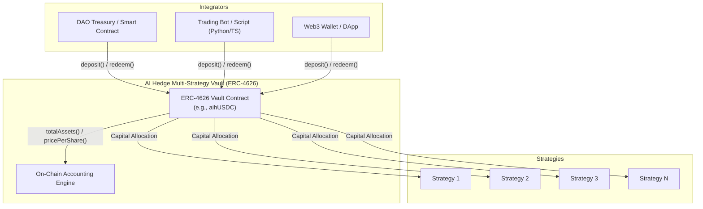

# Developer Overview & Architecture

Welcome to the AI Hedge Developer Documentation. AI Hedge yield vaults are built on the standard **ERC-4626 Tokenized Vault standard** with a modular multi-strategy architecture. 

Because all vaults follow the open, battle-tested ERC-4626 standard, any smart contract, DAO treasury, automated bot, or Web3 application can integrate, deposit, and withdraw programmatically with zero proprietary dependencies.

---

## 1. Vault Architecture

AI Hedge vaults act as non-custodial capital aggregators that accept a single underlying asset (e.g., USDC) and distribute capital across an optimized, dynamically managed queue of underlying yield strategies.

---

## 2. Core Concepts for Developers

### Underlying Asset vs. Share Token
- **Underlying Asset**: The base ERC-20 token deposited into the vault (e.g., **USDC** on Base: `0x833589fCD6eDb6E08f4c7C32D4f71b54bdA02913`).
- **Vault Share Token**: The yield-bearing ERC-20 token minted to the depositor (e.g., **aihUSDC**). Shares represent a pro-rata claim on the total assets and accrued yield within the vault.

### Real-Time Share Accounting
As yield is harvested and compounded by underlying strategies, the total assets held by the vault increase while the total supply of shares remains constant (unless new deposits or withdrawals occur). Consequently, the value of each share increases over time:

$$\text{Price Per Share (PPS)} = \frac{\text{totalAssets}() \times 10^{\text{decimals}}}{\text{totalSupply}()}$$

To calculate the current underlying asset value of any user or treasury holding shares:

$$\text{Underlying Value} = \text{convertToAssets}(\text{userShares})$$

---

## 3. Key Advantages of ERC-4626 Standard

1. **Permissionless Composability**: No API keys, white-listing, or proprietary SDKs required. You interact directly with on-chain smart contracts via standard RPC endpoints.
2. **Deterministic Previews**: Functions like `previewDeposit` and `previewRedeem` allow you to simulate exact return values before broadcasting on-chain transactions.
3. **Instant Liquidity**: Withdrawals are processed on-chain in the same transaction, unwinding strategy positions automatically if necessary.
4. **Standard Tooling**: Works out of the box with standard Web3 libraries:
   - **Solidity**: OpenZeppelin `IERC4626`
   - **TypeScript / JavaScript**: Viem, Wagmi, Ethers.js, Web3.js
   - **Python**: Web3.py
   - **Foundry / Hardhat**: Standard contract ABIs and fork testing

---

## 4. Developer Integration Path

Depending on your architecture, explore the dedicated integration sections:

- **[Institutional Access & Developer Integration](./institutional-access.md)**: ERC-4626 smart contract interfaces, bespoke vaults, Solidity code examples, and API data feeds.
- **[Contract Addresses & Registry](./contract-addresses.md)**: Verified smart contract addresses for all vaults, assets, and strategies on Ethereum and Base.

