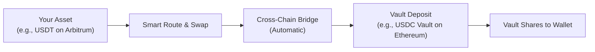

# Depositing & Withdrawing

Depositing into AI Hedge vaults is flexible and automated. You can deposit the vault's native underlying asset directly, or use **1-Click Cross-Chain & Any-Token Routing** to deposit using any token from any supported blockchain without manual swapping or bridging.

---

## 1. Standard Deposit (Same Token & Network)

Use this method when you already hold the required token on the same network where the vault operates (for example, USDC on Ethereum for an Ethereum USDC vault).

### Step-by-Step

1. **Select a Vault** — From the **Vaults Marketplace**, click the vault you wish to join.
2. **Enter Amount** — Type the amount you want to deposit, or click **Max**.
3. **Approve Token (First Time Only)** — If this is your first deposit, click **Approve** and confirm in your wallet.
4. **Confirm Deposit** — Click **Deposit** and sign the transaction in your wallet. You will receive ERC-4626 vault share tokens representing your yield-bearing balance.

---

## 2. Cross-Chain & Any-Token Deposit (1-Click Routing)

If your funds are on another blockchain (like Arbitrum or Base) or in a different token (like USDT or ETH), you **do not need to use external bridges or DEXes**. The DApp automatically swaps and bridges your tokens directly into the vault in a single transaction.

---

### Step 1: Open the Token Selector

In the deposit card on the right side of the vault page, click on the **Token Selector** button inside the amount input field (highlighted below):

---

### Step 2: Choose Your Source Blockchain & Token

Clicking the token selector opens the **Select token** dialog:

1. **Select Chain (Left Menu):** Choose the blockchain where your tokens currently reside (**Ethereum**, **Arbitrum**, **BNB Chain**, **Base**, **Optimism**, or **Polygon**).
2. **Select Token (Right List):** Click the token you want to deposit (e.g., **USDT**, **DAI**, **WETH**, or **WBTC**). The dialog displays your live wallet balance for each asset.

---

### Step 3: Enter Amount & Review Routing

Type the amount of tokens you want to deposit. The interface automatically calculates real-time liquidity routing and displays the exact breakdown:

Here is what each item means in simple terms:

| Field | Meaning |
| :--- | :--- |
| **You Will Deposit** | The exact amount of source tokens being sent from your wallet (e.g., `100 USDT`). |
| **You Will Receive** | The estimated number of vault share tokens (`aihUSDC`) you will get. |
| **Min. You Will Receive** | The guaranteed minimum tokens you will receive after slippage protection. |
| **Slippage Tolerance** | The maximum allowed price fluctuation during swap execution (default: `0.3%`). |
| **Est. Price Impact** | The estimated cost difference of the swap, kept minimal by smart routing. |

---

### Step 4: Approve & Deposit

1. **Network Alignment**: If your connected wallet is on a different blockchain than the vault or selected source route, the primary action button will dynamically display **"Switch to [Network]"** (e.g., *Switch to Ethereum* or *Switch to Base*). Clicking it prompts your wallet to switch chains automatically via standard RPC prompts (`wallet_switchEthereumChain`).
2. **Approve Token**: Click **Approve** (if prompted) to authorize spending of your source token.
3. **Confirm Deposit**: Click **Deposit** (or **Swap & Deposit**) and confirm the transaction in your connected wallet.
4. **Execution**: The system automatically executes the transaction (and any necessary cross-chain swaps/bridges) and mints your vault shares. Once confirmed on-chain, your deposit balance and activity history update immediately.

> [!TIP]
> **No Destination Gas Needed**: When using cross-chain deposits, you only pay gas on the source network where you initiate the deposit. The routing mechanism manages destination execution seamlessly.

---

## 3. How to Withdraw

You can withdraw your funds and accumulated earnings at any time.

1. **Go to the Vault Page** — Navigate to the vault where your deposit is located.
2. **Switch to Withdraw Tab** — Click the **Withdraw** tab in the management panel.
3. **Enter Amount** — Enter the amount you wish to withdraw, or click **Max** to redeem your entire position.
4. **Confirm in Wallet** — Click **Withdraw** and confirm the transaction in your wallet. Your vault shares will be redeemed for the underlying asset plus all accrued yield.

---

## Simple Glossary

- **Vault Shares (`aihUSDC`)**: The receipt token you hold in your wallet. As the vault earns yield, each share becomes worth more underlying tokens.
- **Price Per Share (PPS)**: The on-chain exchange rate between 1 vault share and the underlying asset (e.g., `1 aihUSDC = 1.0129 USDC`). As strategies harvest real cash-flow yield, PPS permanently increases so your shares redeem for more underlying assets upon withdrawal.
- **Yield / APY**: The annual percentage return earned by the vault's automated strategies.
- **Slippage**: The tiny difference between the quoted price and the actual executed price during a token swap.
- **No Lockup**: Your funds remain liquid and can be withdrawn whenever you choose, subject to available market liquidity.
