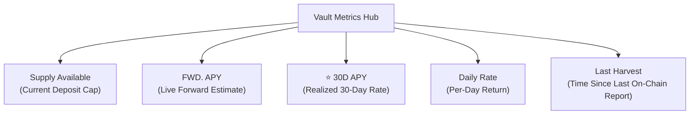
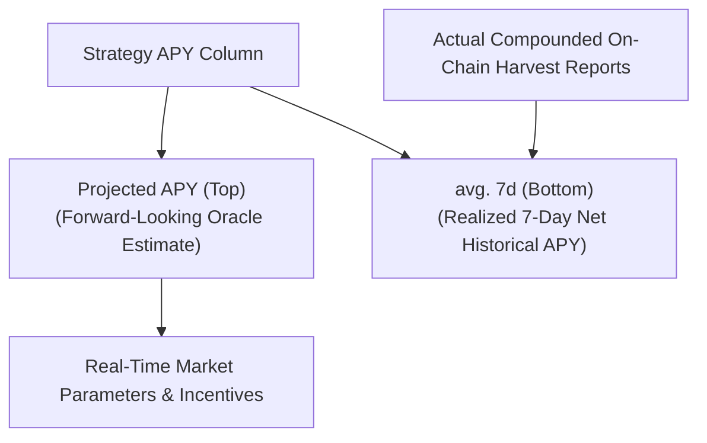

# Understanding Charts & APY Metrics

Every AI Hedge vault detail page provides real-time transparent metrics, historical performance charts, underlying strategy breakdowns, and a complete on-chain activity ledger. This guide explains how to read each chart, how **Price Per Share (PPS)** measures real harvested yield, how **Instantaneous APY** is calculated, and how to track your personal position.

---

## 1. Top Performance Indicators

At the top of each vault page, you will find five core metrics:

- **Supply Available:** The remaining deposit capacity available in the vault before reaching its current TVL risk ceiling.
- **FWD. APY (Forward APY):** The estimated annualized return based on the **current instantaneous rates** of all active sub-strategies weighted by their capital allocation.
- **⭐ 30D APY (30-Day Historical APY):** The **realized, annualized return** achieved by the vault over the preceding 30 days based on physical share price growth. *(Recommended reference metric)*
- **Daily Rate:** The estimated net return generated per 24 hours at current forward rates (e.g., `0.0168% / day`).
- **Last Harvest:** The time elapsed since the vault's strategies last executed an on-chain accounting report (`report()`) to lock in and compound profits.

:::tip[Which rate should you use as a benchmark?]
If you are looking for a single representative metric for reference, use the **⭐ 30D APY**. While **FWD. APY** reflects instantaneous conditions and strategy allocations at this exact moment, **30D APY** measures actual, realized share price compounding over the trailing 30 days, smoothing out short-term market noise.
:::

---

## 2. Price Chart: Price Per Share (PPS) — Real Harvested Yield

By default, the vault chart displays the **PRICE** view. This tracks the **Price Per Share (PPS)** of the vault over time.

### What is Price Per Share (PPS)?

In ERC-4626 standard vaults, you deposit assets (such as USDC) and receive vault share tokens (such as `aihUSDC`). The exchange rate is mathematically defined on-chain:

$$\text{Price Per Share (PPS)} = \frac{\text{Total Underlying Assets in Vault}}{\text{Total Vault Shares Issued}}$$

### Why PPS Represents Real, Harvested Yield

1. **Initial Deposit:** When a vault launches, $1.0\text{ share} = 1.0000\text{ USDC}$.
2. **Strategy Accrual:** As capital is deployed across money markets, liquidity pools, and market making strategies, interest and trading fees accumulate.
3. **On-Chain Harvest (`report()`):** At regular intervals, the strategies execute an on-chain harvest. All accrued revenue is officially collected, converted into the underlying asset (USDC), and deposited directly into the vault balance.
4. **Permanent Growth:** Because profits increase the total assets in the vault while the number of circulating user shares remains unchanged, the **Price Per Share permanently increases** (e.g., $1.0000 \rightarrow 1.0074 \rightarrow 1.0129 \rightarrow 1.0213$).
5. **Redemption Value:** When you withdraw, your return is strictly determined by:

$$\text{Redemption Payout} = \text{Your Shares} \times \text{Current PPS}$$

:::info[No Secondary Market Speculation]
Unlike token trading charts where prices fluctuate due to speculative buy/sell order books, the PPS chart reflects **pure on-chain accounting of physically realized cash-flow profits**. A rising curve represents verified, locked-in gains.
:::

---

## 3. APY Chart: Instantaneous APY (Live Market Velocity)

Clicking the **APY** button on the chart switches the display from cumulative share value to the **Historical Rate (Instantaneous APY)** over time.

### How Instantaneous APY is Calculated

Instantaneous APY represents the **annualized earning rate of the vault at a specific point in time**. It is calculated as the capital-weighted sum of each strategy's live yield minus vault performance fees:

$$\text{Instantaneous APY}(t) = \sum_{i} \Big( w_i(t) \times \text{Strategy APY}_i(t) \Big) \times (1 - \text{Performance Fee})$$

Where:
- $w_i(t)$ is the allocation percentage of total vault capital in Strategy $i$.
- $\text{Strategy APY}_i(t)$ is the live yield rate of Strategy $i$.
- $\text{Performance Fee}$ is the vault-level fee deducted only from generated profits (e.g., 2%).

### Why Does the APY Curve Fluctuate?

DeFi lending and market making venues are dynamic:

- **Lending Utilization:** When borrowing demand rises across money markets, lending rates surge; during low-activity periods, rates moderate.
- **Market Making Velocity & Volatility:** Higher on-chain swap volume generates elevated trading fee velocity.
- **Dynamic Rebalancing:** As the AI Hedge allocator shifts capital from lower-yielding pools into higher-yielding opportunities, the blended vault APY adjusts dynamically.

The APY chart provides visibility into how market conditions and allocator decisions have shaped yield opportunities over preceding weeks.

---

## 4. Strategy Breakdown: Dual Strategy APY (Projected vs. avg. 7d)

Scrolling down on any vault detail page reveals the **Strategies Breakdown** section, featuring an allocation doughnut chart and a detailed breakdown table.

### Understanding the Dual APY Values

In the strategies table, each active strategy row displays two complementary yield metrics:

1. **Projected APY (Top / Primary):**
   - **Definition:** A **forward-looking estimate** calculated by the strategy's oracle based on current market parameters, live borrowing demand, and active incentive programs.
   - **Lending Strategies:** Displays the live variable supply rate per second derived from borrower utilization.
   - **Market Making Strategies:** Displays projected fee yields based on recent trading volume velocity and active reward rates.

2. **avg. 7d (Bottom / Secondary):**
   - **Definition:** The **realized historical net APY** earned on-chain over rolling 7-day harvest reports (`report()`), after deducting performance fees.
   - **Why It Matters:** This measures the actual, verifiable cash-flow return delivered by the strategy over the preceding 7 days, smoothing out temporary spikes and proving physical on-chain profit delivery.

3. **Harvesting Converts Yield into Permanent PPS:**
   - The strategy continuously accrues revenue within its smart contract.
   - When the strategy calls `report()` (indicated by the **LAST REPORT** column, e.g., `44m ago` or `21h ago`), all accrued profit is physically harvested, converted into underlying tokens (USDC), and deposited into the vault.
   - This event permanently increases the vault's **Price Per Share (PPS)**.

---

## 5. "My Activity" Ledger & Cost Basis Tracking

On every vault page, the **My Activity** card provides a transparent, personalized ledger of all interactions between your connected wallet and the vault.

### The 4 Activity Types

The ledger categorizes transactions into four distinct on-chain events:

1. **`DEPOSITED`** — Recorded when you deposit underlying assets (e.g., USDC) into the vault and mint newly issued vault shares (`aihUSDC`) at the prevailing on-chain PPS.
2. **`WITHDRAWN`** — Recorded when you redeem your vault shares to burn them and receive your underlying principal plus all earned yield.
3. **`RECEIVED`** — Recorded when vault share tokens are transferred into your wallet from an external address or third-party smart contract. The ledger automatically logs the exact **PPS at Transfer** for accurate cost basis tracking.
4. **`SENT`** — Recorded when you transfer your vault shares out of your wallet to another recipient or protocol.

### Calculating Your Personal Return (ROI)

Because the ledger captures your **PPS at Transfer / Deposit**, you can calculate your exact percentage gain at any moment:

$$\text{Personal Return (\%)} = \frac{\text{Current PPS} - \text{PPS at Transfer}}{\text{PPS at Transfer}} \times 100\%$$

*Example:* If you received shares at a PPS of `0.9992` and the Current PPS is `1.0098`, your position has generated a $+1.06\%$ net return on principal.

Clicking any transaction row opens the corresponding block explorer (Etherscan, Basescan, or Arbiscan) to verify the transaction hash, gas paid, and block timestamp.

---

## 6. Fee Structure (0% Management / 2% Performance)

AI Hedge adheres to a transparent, performance-aligned fee model:

- **Management Fee: 0%** — We charge zero recurring management or AUM fees. 100% of your deposited capital is actively put to work earning yield without balance decay.
- **Vault Performance Fee: 2%** — A 2% performance fee is assessed strictly on net harvested profits during on-chain `report()` executions. If a strategy produces zero profit during a period, zero fee is charged.

:::note[Illustrative Example]
Fee rates described above represent standard baseline parameters and are **subject to change**. For live, active parameters on any specific vault, always refer to the **Fees** and **Quick Stats** panel on the DApp interface.
:::

---

## 7. Metrics Comparison Cheat Sheet

| Metric | Classification | Computation Source | What It Tells You |
| :--- | :--- | :--- | :--- |
| **Price Per Share (PPS)** | **Realized / Harvested** | On-chain contract state: `totalAssets() / totalSupply()` | The exact amount of underlying asset you will receive per share upon redemption right now. |
| **FWD. APY** | **Forward-Looking** | Capital-weighted live strategy rates minus fees | The expected annualized yield if current market conditions remain steady. |
| **⭐ 30D APY** | **Realized Historical** | 30-day compound rate of change in PPS | The actual annualized return delivered over the last 30 days. Recommended single reference metric for baseline comparisons. |
| **Strategy Projected APY** | **Forward-Looking** | Real-time strategy oracle estimate based on market parameters | The instantaneous earning power and incentives of a specific sub-strategy. |
| **Strategy avg. 7d APY** | **Realized Historical** | Rolling 7-day on-chain harvest reports net of fees | The actual historical net yield delivered by the sub-strategy over the past week. |
| **Daily Rate** | **Forward-Looking** | $\text{FWD. APY} / 365$ | The estimated net yield accrued per day on your principal. |

---

## 8. Built on the ERC-4626 Vault Standard

AI Hedge yield vaults are built directly upon the standardized **ERC-4626 Tokenized Vault standard** and modular multi-strategy architecture:

- **No Speculative Token Buffers:** Yield is never simulated. If an asset is not harvested into real vault capital, it is not reflected in PPS.
- **Fair Fee Mechanics:** The performance fee is assessed strictly upon successful `report()` harvest executions.
- **Full On-Chain Verification:** You can click the contract addresses next to any vault or sub-strategy to independently verify every harvest report, transaction hash, and asset balance on Etherscan, Basescan, or Arbiscan.
